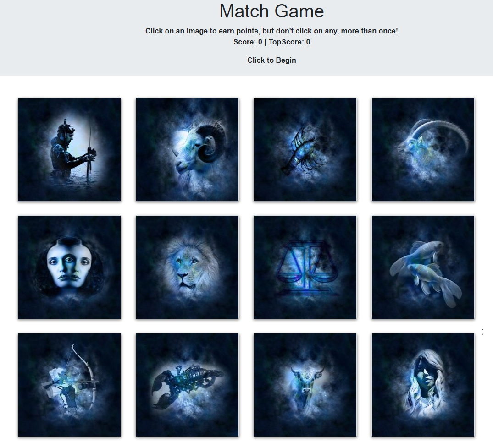

# Clicky Game
This is a very basic client only but fun memory clicky game.  The game is built with React keeping the state of each image clicked, then passes the click as an argument to keep track of each image state.  The game uses horoscope from pixabay.

## Site Imgae


## Table of Contents
- [Technologies Used](#Technologies-Used)
- [Learning Points](#Learning-Points)
- [Use](#Use)
- [Installation](#Installation)
- [Code Snippets](#Code-Snippets)
- [Acknowledgements](#Acknoledgements)
- [Authors](#Authors)

## Technologies Used
- React: App building framework
- JavaScript, jQuery and JSX: Programming language used to build the app
- HTML5 and CSS: Foundation for web apps on browsers
- Bootstrap: Used to provide quick CSS styles to the app

## Learning Points
Building the app helped me to learn how React implements statefullness and sharing variables across components through props.

## Use
https://protected-brook-66326.herokuapp.com/
Click on any image to score points.  You can only click on an image one time.

## Installation
Fork this responsitory.
Open a terminal and navigate to the app folder.
run 'npm install' to install all the react dependencies.
run 'npm start' to build the app. A browser window will open when the app is running.
You can change the files but adding your own files to public/images 225px.  Modifying images.js to point to your images.

## Code Snippets
In this snippet, the handleClick function receives an argument of "clicked" from ImageCard component.  It uses clicked to track the state of the image and determine if it has already been clicked and shuffles the images.
```
  handleClick = (id, clicked) => {
    const shuffleImgs = this.state.images;

    if (clicked) {
      shuffleImgs.forEach((image, index) => {
        shuffleImgs[index].clicked = false;
      });
      return this.setState({
        image: shuffleImgs.sort(() => Math.random() - 0.5),
        message: "You Clicked that one already",
        score: 0
      })
      ...
```
## Acknowledgements
Images were downloaded from pixabay.

## Author
   

[GitHub](https://github.com/chindowns)   
[LinkedIn](https://linkedin.com/in/michaeldownssj)   
Michael Downs   


